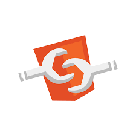
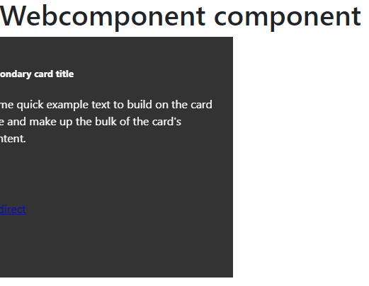
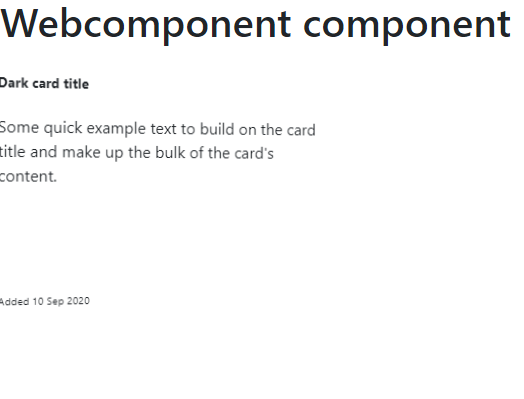
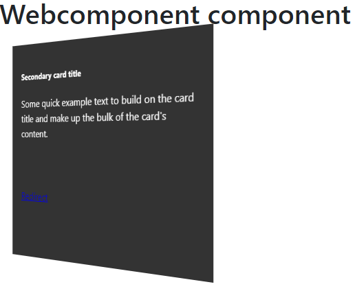
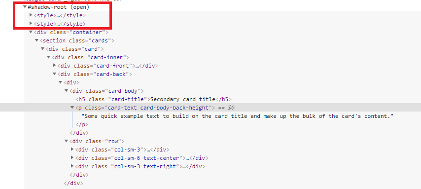

[](https://app.circleci.com/pipelines/github/es-hackathon/bookmark-dashboard-widget)
[](https://www.npmjs.com/package/react)
[](https://github.com/es-hackathon/bookmark-dashboard-widget/blob/master/LICENSE)


# Bookmark Dashboard Widget


<br />
<p align="center">
  <a href="#">
    
    
    
  </a>

  <h3 align="center">Bookmark Dashboard Widget</h3>

  <p align="center">
    Widgets cards which is re-usable and support for multiple  browser with concept of shadow dom 
    <br />
    <a href="https://es-hackathon.github.io/bookmark-dashboard-widget/"><strong>Explore the docs »</strong></a>
    <br />
    <br />
    <a href="https://github.com/es-hackathon/bookmark-dashboard-widget/archive/develop.zip">Download</a>
    ·
    <a href="https://github.com/es-hackathon/bookmark-dashboard-widget/issues/new">Report Bug</a>
    ·
    <a href="https://github.com/es-hackathon/bookmark-dashboard-widget/issues/new">Request Feature</a>
  </p>
</p>

<!-- TABLE OF CONTENTS -->
## Table of Contents

* [About the Project](#about-the-project)
* [How to Run](#How-to-Run)
* [Getting Started](#getting-started)
* [Project description](#project-description)
* [Licence Used](#Licence-Used)

## About the Project

Widgets cards which is re-usable and support for multiple  browser with concept of shadow dom 

## How to Run

```
// Installing npm packages
$ npm install 

// Build application
$ npm build
```

## Getting Started

To add to your application

Step 1:

Add below cdn to your application

```html
<script type="text/javascript" src="<path>/widget-card.js”></script>
```

Step 2:


```html
  <widget-card title="Github" description="GitHub, Inc. is an American multinational corporation that provides 
     hosting for software development and version control using Git. 
     It offers the distributed version control and source code management functionality 
     of Git, plus its own features" 
     url="https://github.com/Amitpnk"
     icon="bookmark"
     date-modified="12 Sep 2020" >
```

## Project description

### Back view of widget



### Front view of widget



### Flip view of widget



### Shadow dom

